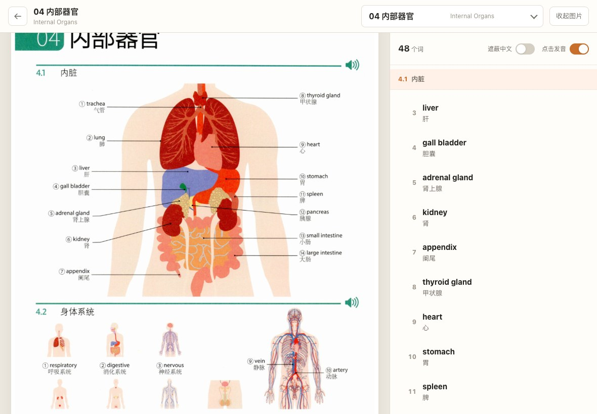

# DK 英语图解词汇学习器

找不到合适的图解单词书？这本可能很适合你。

它把图解页面、英文单词、中文释义和语音读音放在同一个学习界面里。看图建立印象，点词听发音，遮住中文快速自测。适合在电脑网页、iPad 或横屏设备上慢慢学习，也可以在手机上临时查词和短时间复习。

[在线体验](https://jiaxiyou-ctrl.github.io/dk-english-vocab-app/) · [查看源码](https://github.com/jiaxiyou-ctrl/dk-english-vocab-app)

## 效果预览

<p align="center">
  
</p>

<p align="center">
  <em>Web 宽屏：左边看图解页面，右边点读词表。</em>
</p>

<p align="center">
  
</p>

<p align="center">
  <em>iPad 横屏：更接近一本可以点读的电子图解词典。</em>
</p>

## 为什么做这个

很多单词书内容很好，真正难的是每天愿不愿意打开它。

纸质图解书有画面感，适合建立词义印象；网页工具可以补上发音、遮蔽、自测和学习记录。这个项目想把两者放到一起，让一本静态的图解词汇书变得更顺手一点。

记单词很难只靠一行英文。图片能帮助你理解“它是什么”，英文帮助你记住“它怎么说”，声音帮助你形成“它怎么读”的印象。每次点击一个词，都是一次很小的练习：看见它，听见它，再确认它的意思。

## 你可以这样用

- 看图学词：保留图解页面，词汇按主题整理
- 点击发音：点英文单词即可播放读音
- 中英对照：默认显示中文，复习时可以遮住中文
- 轻量自测：先回忆，再点开中文确认
- 学习记录：自动记录学过的词和学习日期

这个工具尽量减少沉重的背词任务。更适合每天打开看一会儿，反复接触，慢慢熟悉。

## 更适合的设备

电脑网页和 iPad 横屏目前体验最好。图片和词表可以并排显示，视线不用来回切换，学习节奏也更舒服。

手机端已经做了适配：图片全宽显示，词表放在底部抽屉里，可以上滑展开。它适合临时查词、听发音、短时间复习。手机屏幕比较窄，长时间学习还是建议换到更大的屏幕。

## 当前内容

| 内容 | 数量 |
| --- | ---: |
| 主题单元 | 180 |
| 内容分类 | 14 |
| 词汇条目 | 9,757 |
| 页面图片 | 300+ |

## 适合谁

- 喜欢通过图片记单词的人
- 已经有图解单词书，希望补上发音和复习功能的人
- 想用 iPad 或电脑获得更舒服的词汇学习体验的人
- 偏好轻量节奏，想少一点打卡压力的人

## 一起优化

这个项目还在继续打磨。单词顺序、图片对应、移动端体验、复习方式，都欢迎根据真实使用感受提出反馈。

如果你发现某个词和图片对不上，某个页面显示不舒服，或者有更适合学习的交互方式，欢迎提 issue 或直接告诉我。这个项目的目标很简单：让一本好用的图解单词书，变成一个更顺手、更轻松的英语学习工具。

## 本地运行

```bash
python3 -m http.server 8080 --directory app
```

然后打开：

```text
http://localhost:8080
```

如果想让手机访问本地版本，需要手机和电脑连接同一个 Wi-Fi，再用手机打开电脑的局域网地址。

## 数据校验

项目提供了一个轻量校验脚本，用于检查主题数量、词数、图片路径和索引一致性：

```bash
python3 scripts/audit_data.py
```

当前校验结果：

- 180 个主题
- 9,757 个词汇条目
- 0 个缺失图片引用
- 0 个索引错误

## 项目结构

```text
app/
  index.html          # 网页入口
  css/style.css       # 页面样式
  js/app.js           # 路由和数据加载
  js/home.js          # 首页
  js/learn.js         # 学习页
  js/progress.js      # 本地进度
  js/speech.js        # 发音
  data/               # 主题和词汇数据
  assets/images/      # 页面图片
scripts/
  audit_data.py       # 数据校验脚本
```

## 版权说明

本项目用于个人学习和技术实践。项目中的图书图片和词汇内容来自原书整理，相关版权归原出版方所有。本项目与 DK 官方无关，请勿用于商业用途或公开传播图书内容。
